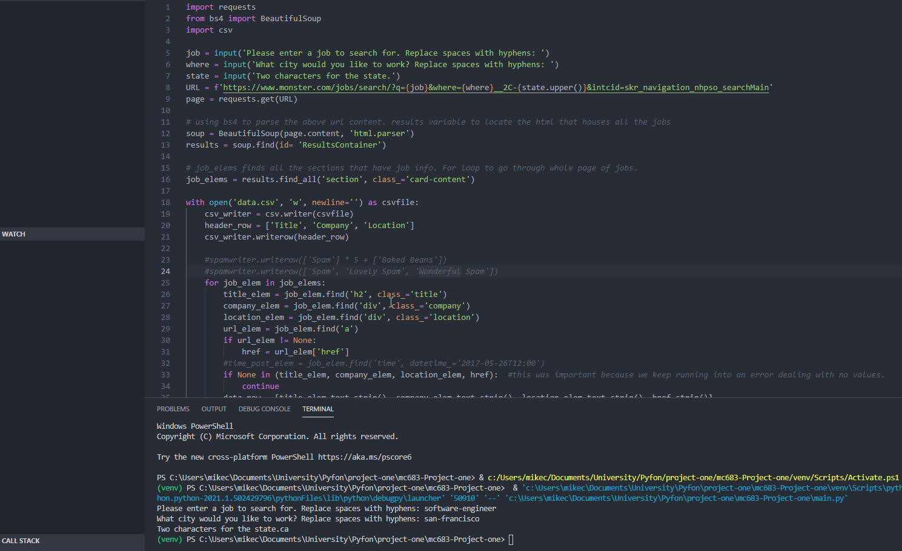

# web-scraper
Web scraper I built for CS 232 Python. After being prompted for what job you're looking for and what location it will return an excel sheet with the jobs listed.

# Job Search Using Python
A web scraping script that gets jobs from Monster.com and stores it in a csv file.
Make sure that you have the latest version of Python and be sure to have the following libraries:
```
pip install bs4
pip install request
pip install csv
```

# How to use
If you are not copying my script file directly then on 
top of your .py file this is the proper import structure:
```
import requests
from bs4 import BeautifulSoup
import csv
```
After installing the libraries all that you have to do is
run the code which will then prompt you to:

1. Enter a job to search for
2. Enter a city
3. Enter a state

After that it will create a csv file in the same location that you created this file in.
Then from there you can use google sheets and upload that csv file and you will have the jobs
listed in each cell in the appropriate categories as well as the links to them so you can apply.



